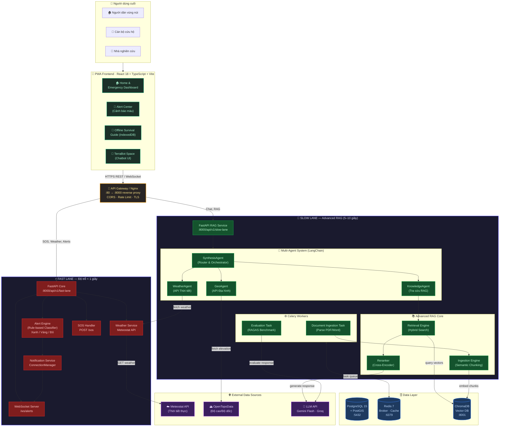
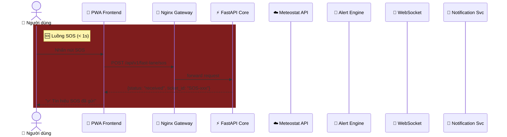
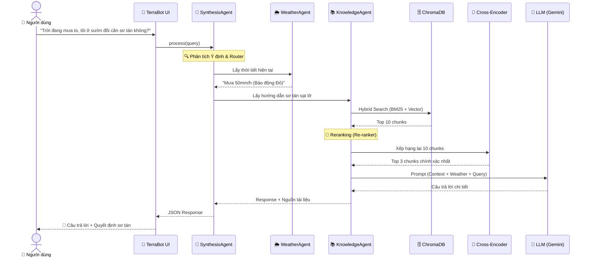
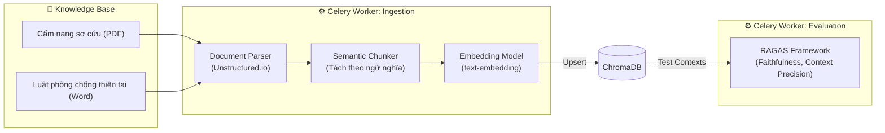
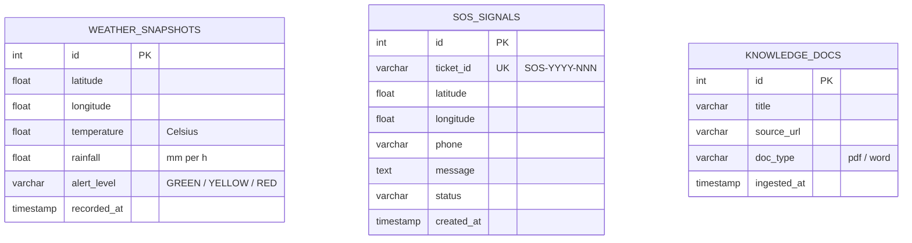

# 🏗️ TerraAlert — Tài Liệu Kiến Trúc Hệ Thống (Advanced RAG)
> **Phiên bản:** 2.0 · **Ngày:** 2026-06-06 · **Tác giả:** Nguyễn Minh Đức

---

## 1. Tổng Quan Kiến Trúc

**TerraAlert** áp dụng kiến trúc **Dual-Lane** (Phân tách Thời gian – Không gian) theo nguyên tắc **CQRS** để giải quyết mâu thuẫn cốt lõi: xử lý cứu nạn tức thời (< 1s) song song với suy luận AI phức tạp (5–10s). Trong phiên bản 2.0, hệ thống tập trung hoàn toàn vào **Advanced Agentic RAG** để hỗ trợ ra quyết định thay vì dùng ML truyền thống.

| Thuộc tính | Giá trị |
|---|---|
| **Kiến trúc** | Dual-Lane + CQRS + Event-Driven |
| **Runtime** | Python 3.9+, Node.js 18+ |
| **Containerization** | Docker + Docker Compose |
| **Database** | PostgreSQL 15 + PostGIS / ChromaDB / Redis |
| **AI Framework** | LangChain · LlamaIndex · Gemini / Groq |
| **Advanced RAG** | Semantic Chunking · Hybrid Search · Cross-Encoder Reranking |

---

## 2. Sơ Đồ Kiến Trúc Tổng Thể (System Architecture Overview)



---

## 3. Sơ Đồ Luồng Dữ Liệu — Fast Lane (Real-time Emergency)

*(Luồng Fast Lane được giữ nguyên, đảm bảo độ trễ < 1s cho SOS và Cảnh báo)*



---

## 4. Sơ Đồ Luồng Dữ Liệu — Slow Lane (Advanced RAG)



---

## 5. Kiến Trúc Data Ingestion & Evaluation (Celery)

Thay vì huấn luyện ML, hệ thống tập trung vào việc xử lý tài liệu lớn và đánh giá RAG tự động.



---

## 6. Sơ Đồ Cơ Sở Dữ Liệu (ER Diagram)



---

## 7. Cấu Trúc Thư Mục Backend Mới

```
backend/
├── app/
│   ├── main.py
│   ├── fast_lane/              # ⚡ Fast Lane (< 1s)
│   │   ├── router.py           # SOS · Weather · WebSocket
│   │   └── services/           # Alert Engine, Notifications
│   ├── api/
│   │   └── rag_router.py       # 🧠 Advanced RAG Endpoint
│   └── rag/                    # Lõi Advanced RAG
│       ├── agents/             # Synthesis, Weather, Geo, Knowledge, Router, LLMGenerator
│       ├── tools/              # API wrappers cho Tools
│       ├── ingestion/          # Semantic chunking, PDF parsing, VectorStore
│       ├── retrieval/          # Hybrid Search, Reranker
│       └── evaluation/         # RAGAS metrics & TruLens
├── tests/
│   ├── rag/                    # Unit tests & Mocking
│   └── test_main.py
└── docker-compose.yml
```
