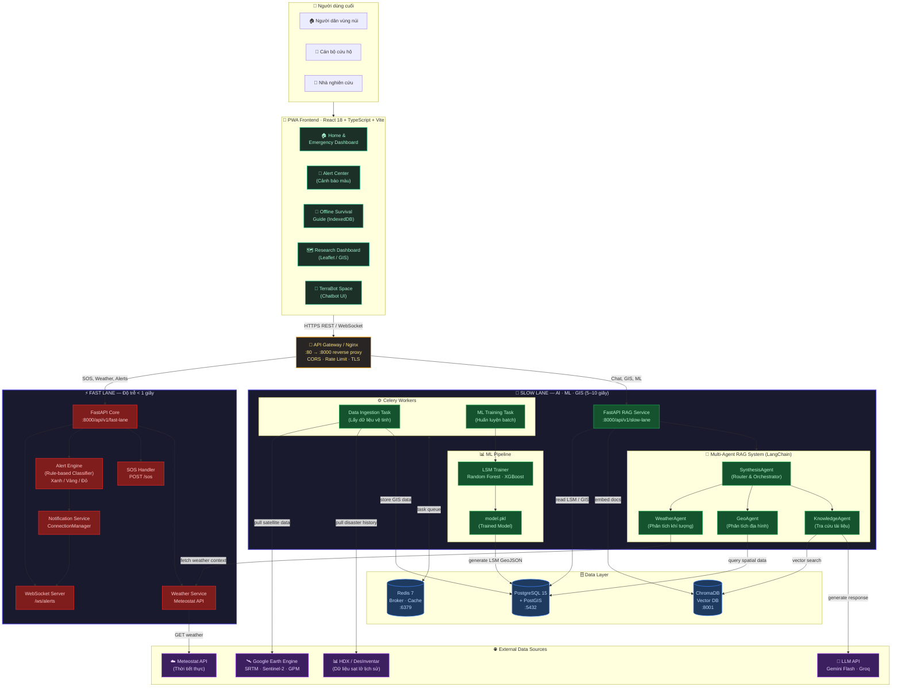
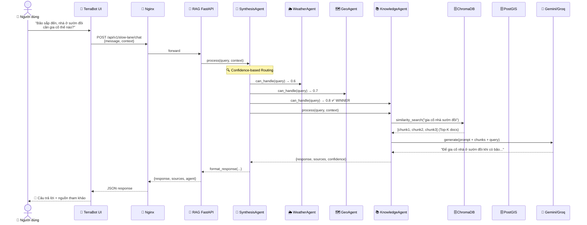
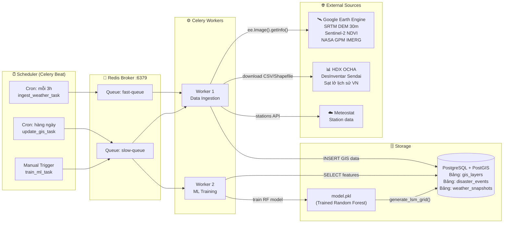
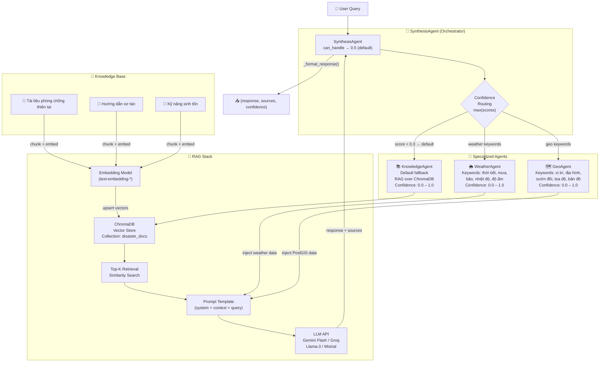
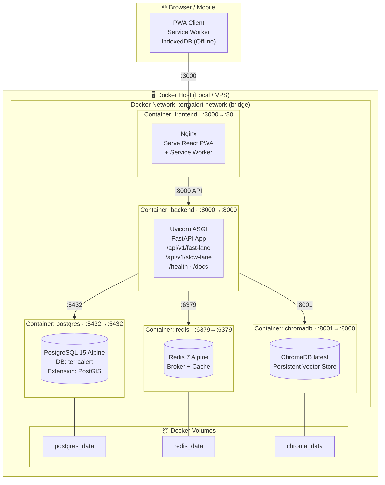
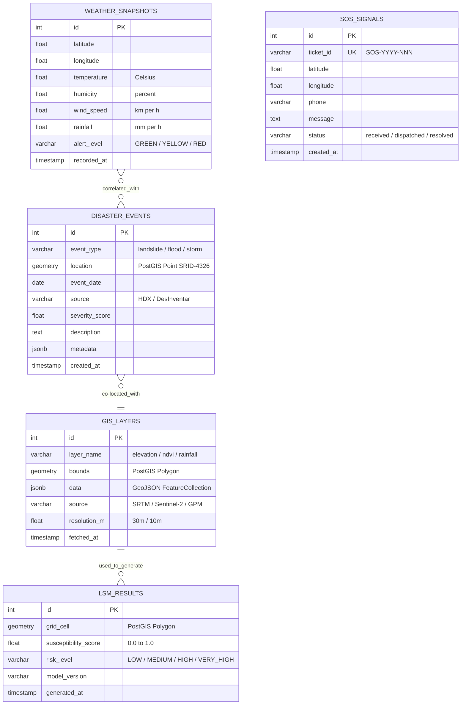
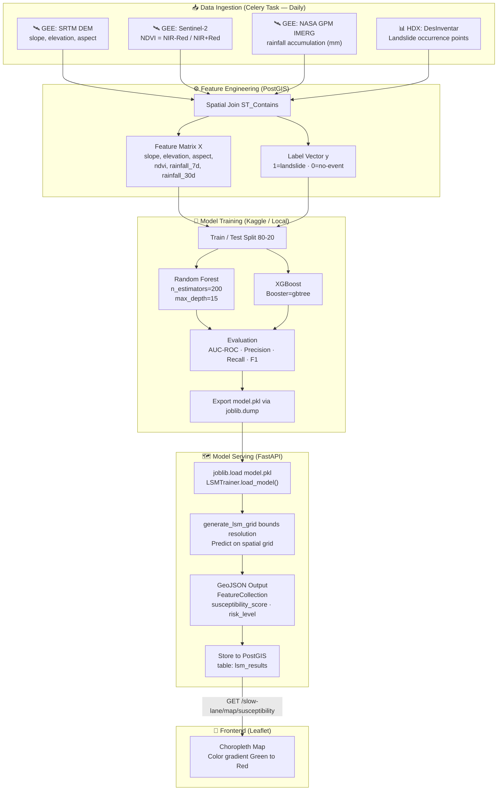

# 🏗️ TerraAlert — Tài Liệu Kiến Trúc Hệ Thống
> **Phiên bản:** 1.0 · **Ngày:** 2026-06-06 · **Tác giả:** Nguyễn Minh Đức

---

## 1. Tổng Quan Kiến Trúc

**TerraAlert** áp dụng kiến trúc **Dual-Lane** (Phân tách Thời gian – Không gian) theo nguyên tắc **CQRS** để giải quyết mâu thuẫn cốt lõi: xử lý cứu nạn tức thời (< 1s) song song với suy luận AI/ML phức tạp (5–10s).

| Thuộc tính | Giá trị |
|---|---|
| **Kiến trúc** | Dual-Lane + CQRS + Event-Driven |
| **Runtime** | Python 3.9+, Node.js 18+ |
| **Containerization** | Docker + Docker Compose |
| **Database** | PostgreSQL 15 + PostGIS / ChromaDB / Redis |
| **AI Framework** | LangChain · LlamaIndex · Gemini / Groq |
| **ML** | scikit-learn Random Forest · XGBoost |

---

## 2. Sơ Đồ Kiến Trúc Tổng Thể (System Architecture Overview)



---

## 3. Sơ Đồ Luồng Dữ Liệu — Fast Lane (Real-time Emergency)

```mermaid
sequenceDiagram
    actor User as 👤 Người dùng
    participant FE as 📱 PWA Frontend
    participant GW as 🔀 Nginx Gateway
    participant FA as ⚡ FastAPI Core
    participant WP as ☁️ Meteostat API
    participant AE as 🔴 Alert Engine
    participant WS as 📡 WebSocket
    participant NS as 🔔 Notification Svc

    %% ── SOS Flow ──
    rect rgb(127, 29, 29)
        note right of User: 🆘 Luồng SOS (< 1s)
        User ->> FE: Nhấn nút SOS
        FE ->> GW: POST /api/v1/fast-lane/sos<br/>{lat, lon, phone, message}
        GW ->> FA: forward request
        FA -->> FE: {status: "received", ticket_id: "SOS-xxx"}
        FE -->> User: "✅ Tín hiệu SOS đã gửi"
    end

    %% ── Weather Alert Flow ──
    rect rgb(78, 63, 0)
        note right of FA: ⏱️ Polling 3 giờ/lần (Cronjob)
        FA ->> WP: GET /weather/{lat}/{lon}
        WP -->> FA: {temp, humidity, wind_speed, rainfall}
        FA ->> AE: classify_weather(params)
        AE -->> FA: AlertLevel {GREEN/YELLOW/RED}
        alt Alert Level = RED hoặc YELLOW
            FA ->> NS: broadcast_alert(level, message)
            NS ->> WS: push to all connections
            WS -->> FE: {type: "alert", level: "RED", ...}
            FE -->> User: 🔴 Push Notification
        end
    end

    %% ── WebSocket Handshake ──
    rect rgb(20, 50, 80)
        note right of User: 🔌 WebSocket Connection
        User ->> FE: Mở App
        FE ->> GW: WS /api/v1/fast-lane/ws/alerts
        GW ->> FA: upgrade to WebSocket
        FA ->> NS: connect(websocket)
        loop Keep-alive
            FE -->> FA: ping
            FA -->> FE: pong
        end
    end
```



---

## 4. Sơ Đồ Luồng Dữ Liệu — Slow Lane (AI / RAG)



---

## 5. Sơ Đồ Celery Worker — Data Ingestion Pipeline



---

## 6. Sơ Đồ Multi-Agent RAG — Chi Tiết



---

## 7. Sơ Đồ Triển Khai Docker (Deployment Diagram)



---

## 8. Sơ Đồ Cơ Sở Dữ Liệu (ER Diagram)



---

## 9. Sơ Đồ ML Pipeline (Landslide Susceptibility Model)



---

## 10. Cấu Trúc Thư Mục Dự Án

```
rag-natural-disaster/
├── frontend/                       # React 18 + TypeScript + Vite PWA
│   ├── src/
│   │   ├── components/
│   │   │   ├── map/                # Leaflet map components
│   │   │   ├── chat/               # TerraBot chatbot UI
│   │   │   └── charts/             # Recharts / D3 visualizations
│   │   ├── pages/                  # 5 route pages
│   │   ├── hooks/                  # Custom React hooks
│   │   ├── services/               # Axios API clients
│   │   └── data/                   # Static survival guide data
│   ├── public/                     # PWA assets, icons, manifest.json
│   ├── nginx.conf                  # Production web server config
│   └── Dockerfile                  # Multi-stage build: node → nginx
│
├── backend/                        # FastAPI + Python 3.9+
│   ├── app/
│   │   ├── main.py                 # FastAPI app factory + CORS
│   │   ├── api/router.py           # Aggregate routers
│   │   ├── core/config.py          # Pydantic Settings
│   │   ├── fast_lane/              # ⚡ Fast Lane (< 1s)
│   │   │   ├── router.py           # SOS · Weather · WebSocket
│   │   │   ├── services/
│   │   │   │   ├── weather_service.py      # Meteostat API client
│   │   │   │   ├── alert_engine.py         # Rule-based classifier
│   │   │   │   └── notification_service.py # WebSocket ConnectionManager
│   │   │   └── models/alert.py     # AlertLevel Pydantic model
│   │   └── slow_lane/              # 🧠 Slow Lane (5–10s)
│   │       ├── router.py           # Chat · LSM · GIS · Tasks
│   │       ├── agents/
│   │       │   ├── base_agent.py       # Abstract BaseAgent
│   │       │   ├── synthesis_agent.py  # Orchestrator (Router)
│   │       │   ├── weather_agent.py    # Weather context agent
│   │       │   ├── geo_agent.py        # Geographic context agent
│   │       │   └── knowledge_agent.py  # ChromaDB RAG agent
│   │       ├── ml/
│   │       │   ├── model_trainer.py    # LSMTrainer (RF + XGB)
│   │       │   └── models/             # Saved .pkl files
│   │       ├── knowledge/
│   │       │   └── document_loader.py  # PDF/Markdown chunker
│   │       ├── services/llm_service.py # Gemini/Groq API wrapper
│   │       ├── db/                     # PostGIS queries
│   │       └── tasks/                  # Celery tasks
│   ├── requirements.txt
│   └── Dockerfile
│
├── ml_training/                    # Offline Training Pipeline
│   ├── scripts/create_dataset.py   # GEE data extraction
│   └── *.ipynb                     # Kaggle training notebooks
│
├── docs/
│   ├── architecture.md             # 📖 This document
│   ├── system_requirements_document.md
│   └── epics_and_stories.md
│
└── docker-compose.yml              # 5 services orchestration
```

---

## 11. API Reference Summary

### Fast Lane (`/api/v1/fast-lane`)

| Method | Endpoint | Mô tả | SLA |
|--------|----------|-------|-----|
| `POST` | `/sos` | Gửi tín hiệu SOS (lat, lon, phone) | < 200ms |
| `GET` | `/weather/{lat}/{lon}` | Lấy thời tiết + mức cảnh báo | < 500ms |
| `GET` | `/alerts` | Danh sách cảnh báo hiện tại | < 100ms |
| `GET` | `/alert-level` | Phân loại cảnh báo từ weather params | < 50ms |
| `WS` | `/ws/alerts` | WebSocket realtime alerts | persistent |
| `GET` | `/ws/status` | Số WebSocket connections đang hoạt động | < 50ms |

### Slow Lane (`/api/v1/slow-lane`)

| Method | Endpoint | Mô tả | SLA |
|--------|----------|-------|-----|
| `POST` | `/chat` | Chat với TerraBot (multi-agent) | < 10s |
| `POST` | `/chat/stream` | Streaming chat response | < 5s TTFB |
| `GET` | `/map/susceptibility` | Bản đồ LSM GeoJSON | < 2s |
| `POST` | `/ml/generate-lsm` | Tạo LSM cho vùng cụ thể | < 30s |
| `POST` | `/ml/train` | Trigger huấn luyện model | async |
| `GET` | `/agents` | Danh sách agents khả dụng | < 50ms |
| `GET` | `/knowledge/categories` | Danh mục knowledge base | < 100ms |
| `GET` | `/data/gis` | Dữ liệu GIS tổng hợp | < 1s |
| `GET` | `/data/elevation` | Thông tin SRTM | < 50ms |
| `GET` | `/data/disasters` | Lịch sử thiên tai HDX | < 1s |
| `GET` | `/tasks/{task_id}` | Trạng thái Celery task | < 100ms |
| `GET` | `/worker/health` | Health check workers + Redis | < 50ms |

---

## 12. Non-Functional Requirements (SLAs)

| Chỉ số | Fast Lane | Slow Lane |
|--------|-----------|-----------|
| **Độ trễ P95** | < 1 giây | < 10 giây |
| **Throughput** | 100 req/s | 10 req/s |
| **Availability** | 99.9% | 99.0% |
| **Offline support** | ✅ PWA + Service Worker | ❌ Cần internet |
| **WebSocket** | ✅ Persistent realtime | ❌ N/A |
| **Streaming** | ❌ N/A | ✅ SSE / Server-Sent Events |

---

> 📌 **Ghi chú:** Tài liệu này được xây dựng từ phân tích source code thực tế ngày 2026-06-06.
> Cập nhật tài liệu này mỗi khi có thay đổi kiến trúc.
