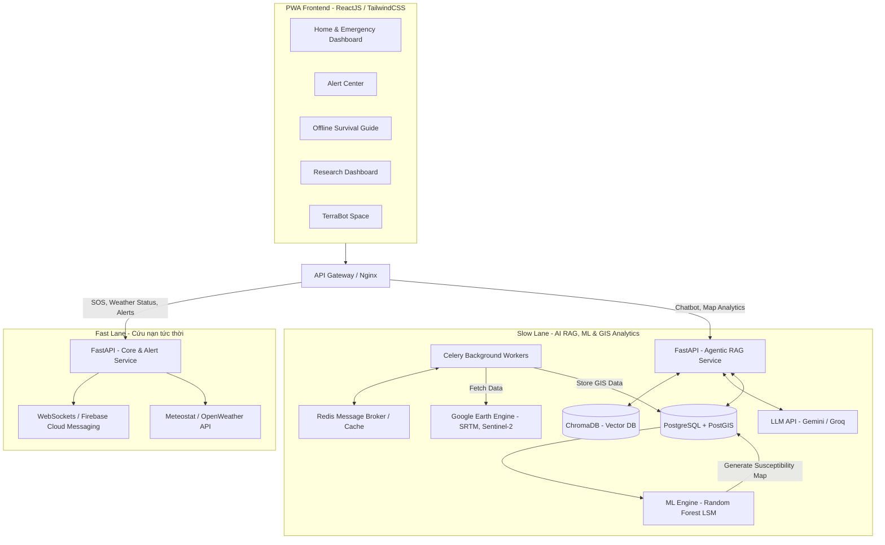

# Kiến Trúc Hệ Thống Tổng Thể (System Architecture)

Dự án **TerraAlert** áp dụng nguyên tắc **CQRS** (Command Query Responsibility Segregation) và kiến trúc Event-Driven nhằm giải quyết bài toán mâu thuẫn giữa luồng xử lý khẩn cấp (tốc độ cao) và luồng phân tích AI RAG/ML (độ trễ cao).

## 1. Sơ Đồ Kiến Trúc Phân Tách

Hệ thống được chia làm hai luồng (Lanes) xử lý độc lập:

## 2. Chi Tiết Các Component

### 2.1 Fast Lane (Luồng Khẩn Cấp)
- **Công nghệ:** FastAPI, WebSockets/FCM, Basic REST.
- **Mục tiêu:** Độ trễ cực thấp (< 1 giây).
- **Phạm vi:** Xử lý tín hiệu SOS, định vị tức thời, tra cứu thời tiết bằng API nhẹ (Meteostat), và đẩy cảnh báo Push Notifications.
- **Quy tắc:** Không gọi AI, mô hình học máy hay Database nặng ở luồng này.

### 2.2 Slow Lane (Luồng Trí Tuệ Nhân Tạo & Nghiên Cứu)
- **Công nghệ:** Celery, Redis, PostGIS, ChromaDB, LangChain, Scikit-learn (Machine Learning).
- **Mục tiêu:** Xử lý lượng dữ liệu khổng lồ (vệ tinh, HDX) và chạy suy luận mô hình.
- **Phạm vi:** 
  - *Data Ingestion:* Tự động kéo dữ liệu vệ tinh từ NASA, GEE định kỳ.
  - *Machine Learning (LSM):* Huấn luyện và dự đoán bản đồ nhạy cảm sạt lở (Landslide Susceptibility Mapping) dựa trên thuật toán Random Forest từ dữ liệu lịch sử HDX và vệ tinh.
  - *Agentic RAG:* TerraBot phân tích kiến thức sinh tồn, kết hợp toạ độ và thời tiết để trả lời câu hỏi bằng ngôn ngữ tự nhiên.

### 2.3 PWA Frontend (Bảo vệ offline)
- Cẩm nang sinh tồn số (Offline Survival Guide) được tải sẵn thông qua Service Workers và IndexedDB. Đảm bảo người dùng vùng núi vẫn có thể truy cập được khi hạ tầng mạng bị sập do bão lũ.
